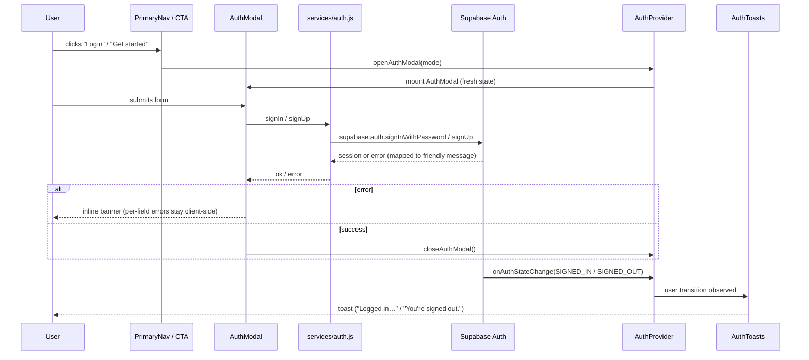
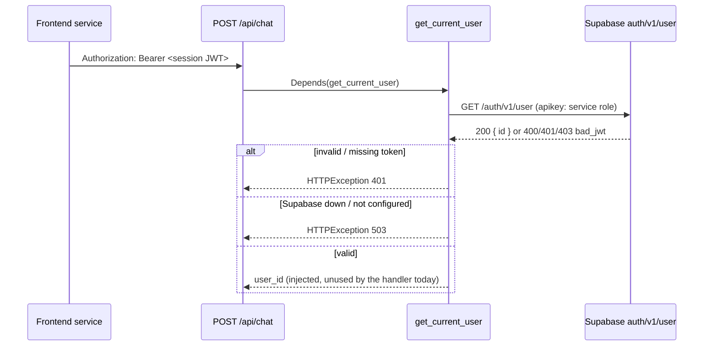
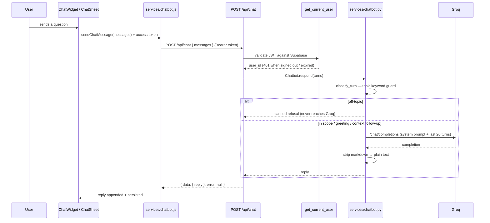
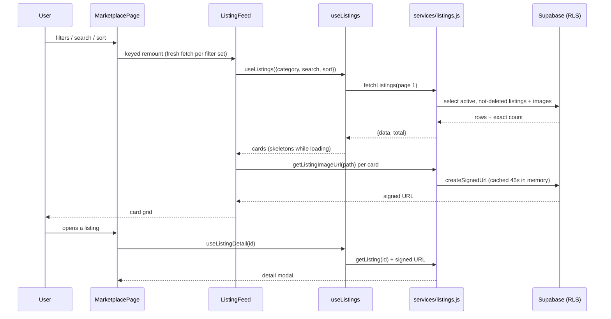
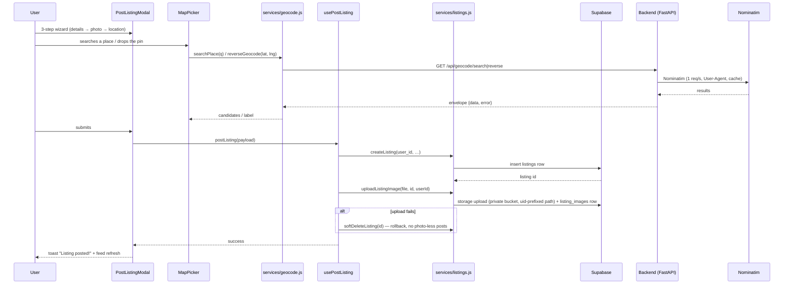
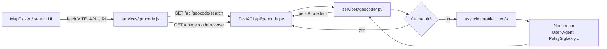

# Architecture

## Stack

| Layer | Technology |
|---|---|---|
| Website | React 19, react-router v7, Tailwind CSS v4, Leaflet (react-leaflet v5), plain JavaScript |
| Backend | FastAPI (async), httpx, pydantic-settings |
| Database + Auth + Storage | Supabase (PostgreSQL, email/password auth, private buckets) |
| Geocoding | Nominatim / OpenStreetMap, proxied through the backend |
| Palay Assistant | Groq-hosted `openai/gpt-oss-20b` (chat-completions), proxied through the backend |
| Mobile | Expo SDK 57 (React Native), React Navigation v7, Inter typeface — intro landing + bottom-tab shell + marketplace browse + full email/password auth + Palay Assistant shipped |

**Key rules:** the backend is the sole gateway to external APIs. The frontend
never calls Nominatim, Groq, or any third-party service directly — everything
routes through FastAPI. Protected backend routes validate the caller's
Supabase JWT server-side; no client-supplied identity is trusted.

## Authentication flow



Notes:

- `AuthProvider` is the only subscriber to `supabase.auth.onAuthStateChange`.
  Components read `user` / `isInitializing` from context — no ad-hoc
  `getSession()` calls.
- `AuthModal` mounts only while open (conditional render in `App.jsx`), so form
  state is always fresh; `Modal` restores focus to the trigger on close.
- Email confirmation is enforced: `signUp` with a null session returns
  `requiresEmailConfirmation` and the UI shows a "check your inbox" state.
- Returning from an email confirmation link is detected by snapshotting
  `location.hash` at module load (`utils/authUrlHint.js`) — supabase-js strips
  the hash shortly after.

> **Mobile branch.** supabase-js never detects sessions from a URL on React
> Native, so the mobile `AuthProvider` keeps its own deep-link listener on the
> app scheme (`palaysigla://auth/callback`, built by the mobile
> `utils/authUrlHint.js`). `services/auth.js#completeAuthRedirect` performs the
> hand-off — PKCE `?code=` via `exchangeCodeForSession`, or the implicit
> fragment tokens via `setSession` — and reopens the auth dialog in the
> matching mode (verified panel for `type=signup`, a new-password form for
> `type=recovery`). Entry modes and the chat open-intent travel through
> `openAuthModal(mode, options)`; mobile ships no toast layer, so auth
> feedback is the dialog itself, the chat sheet, and the Settings account
> summary. The Supabase dashboard must allow-list the app return URL (see the
> ACTION REQUIRED marker in `setup-supabase.md`).

## Backend authentication

Protected routes (currently `/api/chat`) never trust the client payload for
identity. A reusable FastAPI dependency (`app/core/auth.py#get_current_user`)
reads the `Authorization: Bearer <token>` header and validates the JWT
server-side by calling `GET {SUPABASE_URL}/auth/v1/user` with the
service-role key:



The frontend gets its token from `supabase.auth.getSession()` at call time —
no token is ever stored outside the Supabase session. Supabase reports
malformed/expired/unknown JWTs as `400`/`401`/`403`; all three map to a `401`
"sign in again" response so a session outage is never confused with an auth
failure.

## Palay Assistant (chat)

Both apps expose the same assistant behind a signed-in gate. The website
floats a launcher + panel on every route; the mobile app floats a launcher
over the tab shell that opens a root-level bottom sheet. Both keep a per-user
history (localStorage on web, AsyncStorage on mobile) under a
`palaysigla:chat:<user_id>` key, capped at 20 turns like the server.



Notes:

- **Two-stage safeguard.** Stage 1 is a word-boundary Tagalog/English
  vocabulary (`palay`, `bigas`, moisture, `amag`, storage, grading, prices,
  …) plus greetings; clearly off-topic turns get a fixed polite refusal and
  never cost a model call. Contextual short follow-ups ("Paano pa?", "Bakit?")
  count as in-scope only when an earlier user turn matched a topic term.
  Stage 2 is the system prompt: rice/palay scope only, mirror the user's
  language, plain text, no emojis/markdown, cite PhilRice when unsure.
- **Replies are plain text.** The backend strips markdown markers from model
  output; clients render plain-text bubbles (line breaks preserved) with no
  markdown parser.
- **History and limits.** Server: 1–20 turns, each 1–2000 chars, roles
  `user`/`assistant` only, last turn must be from the user. Client inputs cap
  at 2000 chars and send at most the newest 20 turns.
- **Metered, so throttled twice.** Per-IP API limiter defaults to 6 requests
  per 60 s, and Groq HTTP 429 surfaces as `429 RATE_LIMITED` ("busy") rather
  than a 502.
- **Signed-out behaviour.** Web: tapping the launcher opens the auth modal in
  Login mode (chat opens only on the next tap after sign-in). Mobile: the
  launcher opens the auth dialog with a `chatIntent`; a successful sign-in
  closes the dialog and opens the chat sheet automatically. Sign-out closes
  any open sheet; per-user keys mean an account switch never exposes the
  previous user's history.

## Marketplace — browse



Notes:

- RLS filters rows server-side: only `status = 'active'` and
  `deleted_at IS NULL` listings are visible to readers.
- The feed is remounted with a `key` when filters change (`feedKey`), which
  gives it fresh loading state and resets to page 1.
- Search is debounced 350 ms in `MarketplacePage`; load-more appends the next
  page (12 rows).
- Signed URLs are cached per storage path with a 45 s TTL so the grid does not
  re-sign on every render.

## Marketplace — post a listing



Notes:

- The photo is validated (JPEG/PNG, ≤ 10 MB) and re-encoded client-side via
  canvas (max 1600 px, quality 0.82), which strips EXIF/GPS.
- Storage path is `{user_id}/{listing_id}/0.jpg`; the storage RLS insert
  policy enforces the `auth.uid()` prefix.
- Owner actions (mark sold / remove) run through the same service layer; removals
  are soft deletes (`deleted_at`), never hard deletes.

## Geocoding proxy



- Cache keys: normalized query + limit for search; coordinates rounded to 4
  decimals (~11 m) for reverse. TTL 24 h (configurable).
- The service raises `HTTPException(502)` when Nominatim is unreachable or
  errors; 429 when rate limited.

## ML inference (not yet implemented)

The four scan outputs (quality status, mold detection, market grade, variety
classification) and the mobile Scan tab are planned but unstarted: no model
artifacts, no `app/ml/` module, and no inference endpoints exist. The
intended shape (load-once via lifespan, run inference off the event loop,
per-class confidence with a `needs_review` flag) is documented in
`AGENTS.md`, not in this file, until code lands.

## Repository layout

```
├── website/          React web app (services, context, hooks, components, pages)
├── backend/          FastAPI app (app/, tests/, pyproject.toml)
├── schemas/          Supabase SQL migrations + seed scripts
├── mobile/           React Native app (Expo) — landing + tab shell + marketplace browse + auth + assistant
├── documentation/    These docs
├── AGENTS.md         Engineering rules
└── DESIGN.md         Design system
```
