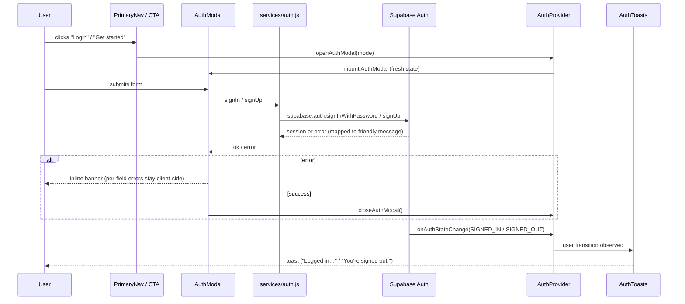
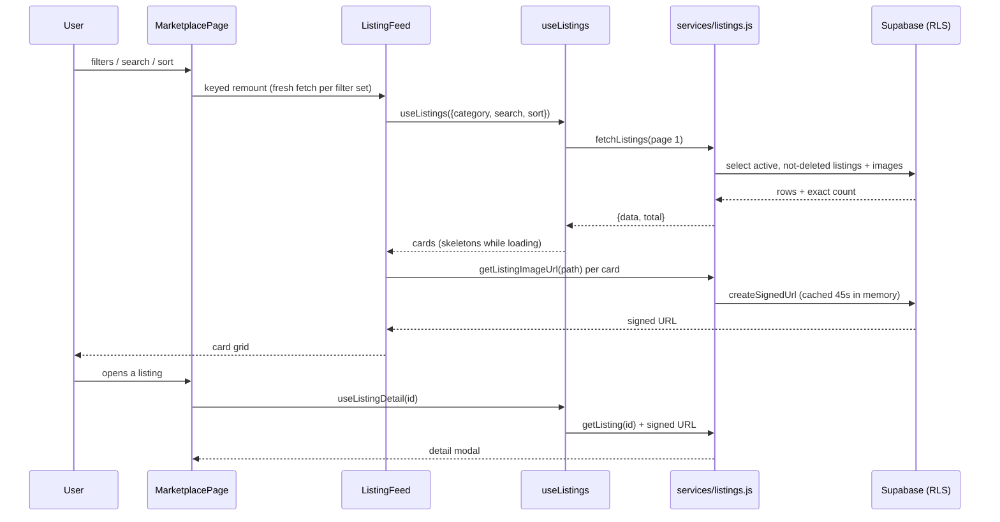
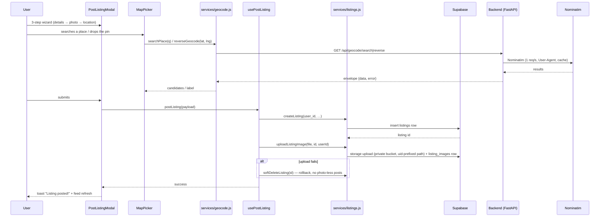
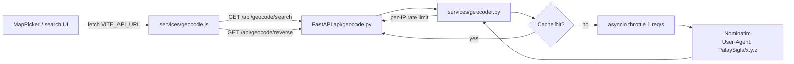

# Architecture

## Stack

| Layer | Technology |
|---|---|
| Website | React 19, react-router v7, Tailwind CSS v4, Leaflet (react-leaflet v5), plain JavaScript |
| Backend | FastAPI (async), httpx, pydantic-settings |
| Database + Auth + Storage | Supabase (PostgreSQL, email/password auth, private buckets) |
| Geocoding | Nominatim / OpenStreetMap, proxied through the backend |
| Mobile | Expo SDK 57 (React Native), React Navigation v7, Inter typeface — landing screen shipped |

**Key rule:** the backend is the sole gateway to external APIs. The frontend
never calls Nominatim (or any third-party service) directly — everything
routes through FastAPI.

## Authentication flow



Notes:

- `AuthProvider` is the only subscriber to `supabase.auth.onAuthStateChange`.
  Components read `user` / `isInitializing` from context — no ad-hoc
  `getSession()` calls.
- `AuthModal` mounts only while open (conditional render in `App.jsx`), so form
  state is always fresh; `Modal` restores focus to the trigger on close.
- Email confirmation is enforced: `signUp` with a null session returns
  `requiresEmailConfirmation` and the UI shows a "check your inbox" state.
- Returning from an email confirmation link is detected by snapshotting
  `location.hash` at module load (`utils/authUrlHint.js`) — supabase-js strips
  the hash shortly after.

## Marketplace — browse



Notes:

- RLS filters rows server-side: only `status = 'active'` and
  `deleted_at IS NULL` listings are visible to readers.
- The feed is remounted with a `key` when filters change (`feedKey`), which
  gives it fresh loading state and resets to page 1.
- Search is debounced 350 ms in `MarketplacePage`; load-more appends the next
  page (12 rows).
- Signed URLs are cached per storage path with a 45 s TTL so the grid does not
  re-sign on every render.

## Marketplace — post a listing



Notes:

- The photo is validated (JPEG/PNG, ≤ 10 MB) and re-encoded client-side via
  canvas (max 1600 px, quality 0.82), which strips EXIF/GPS.
- Storage path is `{user_id}/{listing_id}/0.jpg`; the storage RLS insert
  policy enforces the `auth.uid()` prefix.
- Owner actions (mark sold / remove) run through the same service layer; removals
  are soft deletes (`deleted_at`), never hard deletes.

## Geocoding proxy



- Cache keys: normalized query + limit for search; coordinates rounded to 4
  decimals (~11 m) for reverse. TTL 24 h (configurable).
- The service raises `HTTPException(502)` when Nominatim is unreachable or
  errors; 429 when rate limited.

## Repository layout

```
├── website/          React web app (services, context, hooks, components, pages)
├── backend/          FastAPI app (app/, tests/, pyproject.toml)
├── schemas/          Supabase SQL migrations + seed scripts
├── mobile/           React Native app (Expo) — landing screen shipped; flows pending
├── documentation/    These docs
├── AGENTS.md         Engineering rules
└── DESIGN.md         Design system
```
