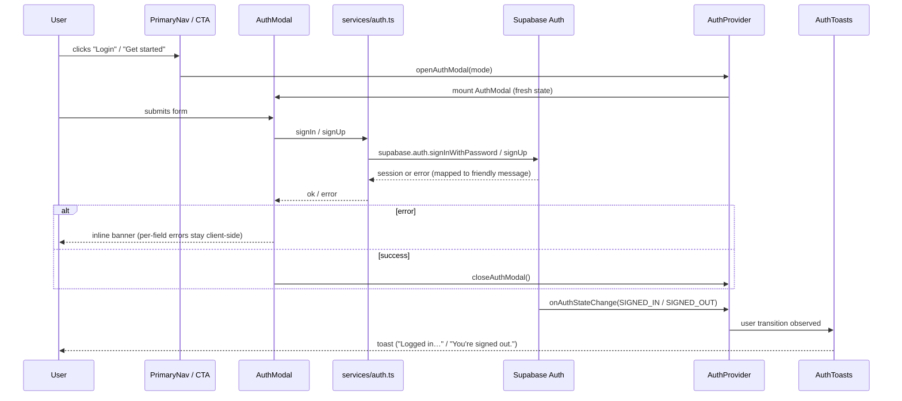
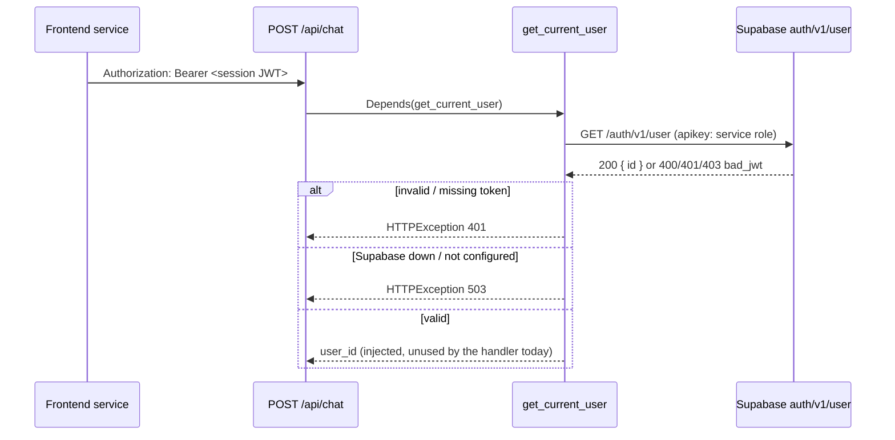
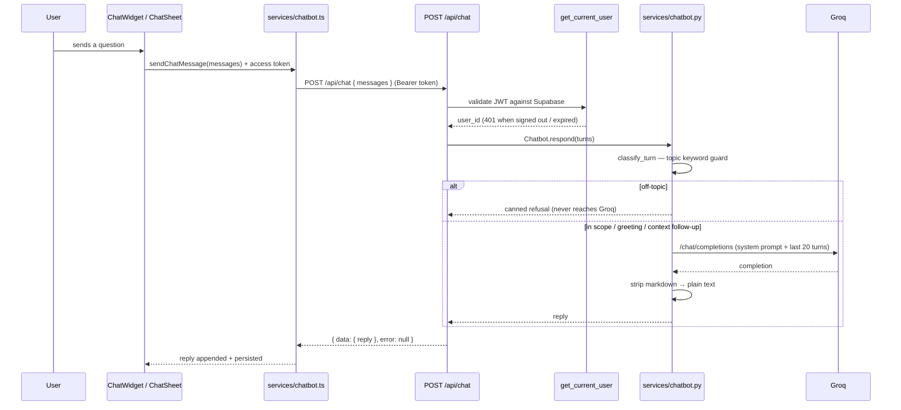
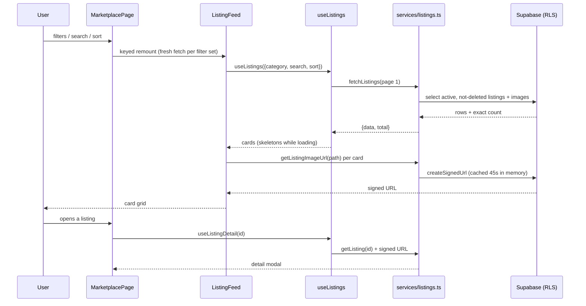
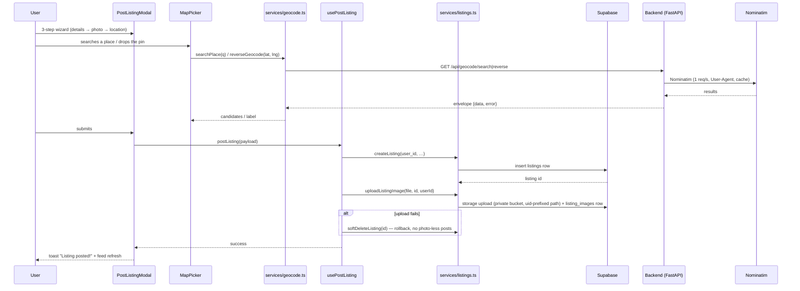
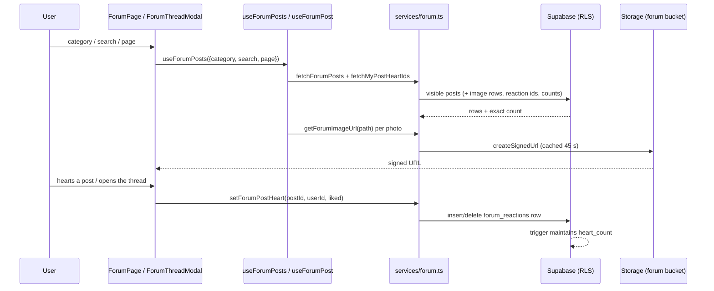
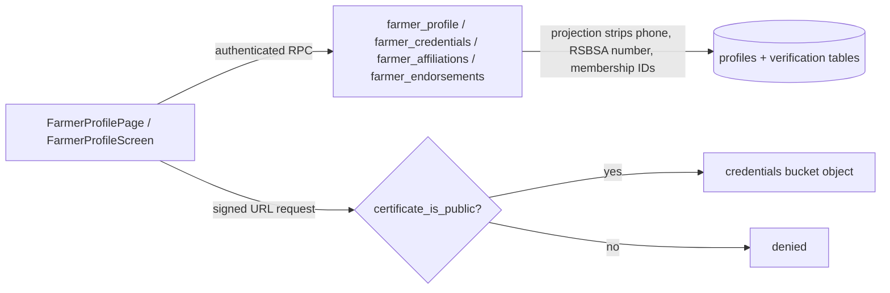
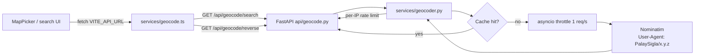
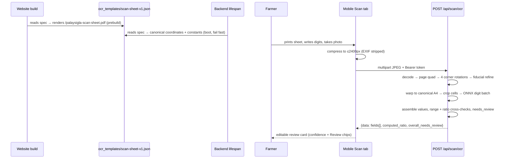

# Architecture

## Stack

| Layer | Technology |
|---|---|---|
| Website | React 19, react-router v7, Tailwind CSS v4, Leaflet (react-leaflet v5), TanStack Table v9, pdf-lib (scan sheet), TypeScript (strict) |
| Backend | FastAPI (async), httpx, pydantic-settings, OpenCV, ONNX Runtime — deployed on Render (`render.yaml`) |
| Database + Auth + Storage | Supabase (PostgreSQL, email/password auth, private buckets) |
| Realtime | Supabase Realtime (Postgres Changes over WebSocket) for marketplace messaging |
| Geocoding | Nominatim / OpenStreetMap, proxied through the backend |
| Palay Assistant | Groq-hosted `openai/gpt-oss-20b` (chat-completions), proxied through the backend |
| OCR | Printable sheet spec (`ocr_templates/scan-sheet-v1.json`) → website-rendered PDF → handwritten digit CNN (ONNX) in the backend |
| Mobile | Expo SDK 57 (React Native), React Navigation v7, TypeScript (strict), Inter typeface, WebView Leaflet, Supabase Realtime — landing + tab shell, marketplace, forum, messaging, profile + verification wall, Palay Assistant, scan-sheet OCR shipped |

**Key rules:** the backend is the sole gateway to external APIs. The frontend
never calls Nominatim, Groq, or any third-party service directly — everything
routes through FastAPI. Protected backend routes validate the caller's
Supabase JWT server-side; no client-supplied identity is trusted.

## Authentication flow


```mermaid
sequenceDiagram
    participant U as User
    participant N as PrimaryNav / CTA
    participant M as AuthModal
    participant S as services/auth.ts
    participant SB as Supabase Auth
    participant P as AuthProvider
    participant T as AuthToasts

    U->>N: clicks "Login" / "Get started"
    N->>P: openAuthModal(mode)
    P->>M: mount AuthModal (fresh state)
    U->>M: submits form
    M->>S: signIn / signUp
    S->>SB: supabase.auth.signInWithPassword / signUp
    SB-->>S: session or error (mapped to friendly message)
    S-->>M: ok / error
    alt error
        M-->>U: inline banner (per-field errors stay client-side)
    else success
        M->>P: closeAuthModal()
    end
    SB->>P: onAuthStateChange(SIGNED_IN / SIGNED_OUT)
    P->>T: user transition observed
    T-->>U: toast ("Logged in…" / "You're signed out.")
```

Notes:

- `AuthProvider` is the only subscriber to `supabase.auth.onAuthStateChange`.
  Components read `user` / `isInitializing` from context — no ad-hoc
  `getSession()` calls.
- `AuthModal` mounts only while open (conditional render in `App.tsx`), so form
  state is always fresh; `Modal` restores focus to the trigger on close.
- Email confirmation is enforced: `signUp` with a null session returns
  `requiresEmailConfirmation` and the UI shows a "check your inbox" state.
- Returning from an email confirmation link is detected by snapshotting
  `location.hash` at module load (`utils/authUrlHint.ts`) — supabase-js strips
  the hash shortly after.

> **Mobile branch.** supabase-js never detects sessions from a URL on React
> Native, so the mobile `AuthProvider` keeps its own deep-link listener on the
> app scheme (`palaysigla://auth/callback`, built by the mobile
> `utils/authUrlHint.ts`). `services/auth.ts#completeAuthRedirect` performs the
> hand-off — PKCE `?code=` via `exchangeCodeForSession`, or the implicit
> fragment tokens via `setSession` — and reopens the auth dialog in the
> matching mode (verified panel for `type=signup`, a new-password form for
> `type=recovery`). Entry modes and the chat open-intent travel through
> `openAuthModal(mode, options)`; mobile ships no toast layer, so auth
> feedback is the dialog itself, the chat sheet, and the Settings account
> summary. The Supabase dashboard must allow-list the app return URL (see the
> ACTION REQUIRED marker in `setup-supabase.md`).

## Backend authentication

Protected routes (currently `/api/chat`) never trust the client payload for
identity. A reusable FastAPI dependency (`app/core/auth.py#get_current_user`)
reads the `Authorization: Bearer <token>` header and validates the JWT
server-side by calling `GET {SUPABASE_URL}/auth/v1/user` with the
service-role key:


```mermaid
sequenceDiagram
    participant F as Frontend service
    participant R as POST /api/chat
    participant D as get_current_user
    participant SB as Supabase auth/v1/user
    F->>R: Authorization: Bearer <session JWT>
    R->>D: Depends(get_current_user)
    D->>SB: GET /auth/v1/user (apikey: service role)
    SB-->>D: 200 { id } or 400/401/403 bad_jwt
    alt invalid / missing token
        D-->>R: HTTPException 401
    else Supabase down / not configured
        D-->>R: HTTPException 503
    else valid
        D-->>R: user_id (injected, unused by the handler today)
    end
```

The frontend gets its token from `supabase.auth.getSession()` at call time —
no token is ever stored outside the Supabase session. Supabase reports
malformed/expired/unknown JWTs as `400`/`401`/`403`; all three map to a `401`
"sign in again" response so a session outage is never confused with an auth
failure.

## Palay Assistant (chat)

Both apps expose the same assistant behind a signed-in gate. The website
floats a launcher + panel on every route; the mobile app floats a launcher
over the tab shell that opens a root-level bottom sheet. Both keep a per-user
history (localStorage on web, AsyncStorage on mobile) under a
`palaysigla:chat:<user_id>` key, capped at 20 turns like the server.


```mermaid
sequenceDiagram
    participant U as User
    participant W as ChatWidget / ChatSheet
    participant S as services/chatbot.ts
    participant A as POST /api/chat
    participant D as get_current_user
    participant B as services/chatbot.py
    participant G as Groq

    U->>W: sends a question
    W->>S: sendChatMessage(messages) + access token
    S->>A: POST /api/chat { messages } (Bearer token)
    A->>D: validate JWT against Supabase
    D-->>A: user_id (401 when signed out / expired)
    A->>B: Chatbot.respond(turns)
    B->>B: classify_turn — topic keyword guard
    alt off-topic
        B-->>A: canned refusal (never reaches Groq)
    else in scope / greeting / context follow-up
        B->>G: /chat/completions (system prompt + last 20 turns)
        G-->>B: completion
        B->>B: strip markdown → plain text
        B-->>A: reply
    end
    A-->>S: { data: { reply }, error: null }
    S-->>W: reply appended + persisted
```

Notes:

- **Two-stage safeguard.** Stage 1 is a word-boundary Tagalog/English
  vocabulary (`palay`, `bigas`, moisture, `amag`, storage, grading, prices,
  …) plus greetings; clearly off-topic turns get a fixed polite refusal and
  never cost a model call. Contextual short follow-ups ("Paano pa?", "Bakit?")
  count as in-scope only when an earlier user turn matched a topic term.
  Stage 2 is the system prompt: rice/palay scope only, mirror the user's
  language, plain text, no emojis/markdown, cite PhilRice when unsure.
- **Replies are plain text.** The backend strips markdown markers from model
  output; clients render plain-text bubbles (line breaks preserved) with no
  markdown parser.
- **History and limits.** Server: 1–20 turns, each 1–2000 chars, roles
  `user`/`assistant` only, last turn must be from the user. Client inputs cap
  at 2000 chars and send at most the newest 20 turns.
- **Metered, so throttled twice.** Per-IP API limiter defaults to 6 requests
  per 60 s, and Groq HTTP 429 surfaces as `429 RATE_LIMITED` ("busy") rather
  than a 502.
- **Signed-out behaviour.** Web: tapping the launcher opens the auth modal in
  Login mode (chat opens only on the next tap after sign-in). Mobile: the
  launcher opens the auth dialog with a `chatIntent`; a successful sign-in
  closes the dialog and opens the chat sheet automatically. Sign-out closes
  any open sheet; per-user keys mean an account switch never exposes the
  previous user's history.

## Marketplace — browse


```mermaid
sequenceDiagram
    participant U as User
    participant PG as MarketplacePage
    participant F as ListingFeed
    participant H as useListings
    participant S as services/listings.ts
    participant SB as Supabase (RLS)

    U->>PG: filters / search / sort
    PG->>F: keyed remount (fresh fetch per filter set)
    F->>H: useListings({category, search, sort})
    H->>S: fetchListings(page 1)
    S->>SB: select active, not-deleted listings + images
    SB-->>S: rows + exact count
    S-->>H: {data, total}
    H-->>F: cards (skeletons while loading)
    F->>S: getListingImageUrl(path) per card
    S->>SB: createSignedUrl (cached 45s in memory)
    SB-->>F: signed URL
    F-->>U: card grid
    U->>PG: opens a listing
    PG->>H: useListingDetail(id)
    H->>S: getListing(id) + signed URL
    S-->>PG: detail modal
```

Notes:

- RLS filters rows server-side: only `status = 'active'` and
  `deleted_at IS NULL` listings are visible to readers.
- The feed is remounted with a `key` when filters change (`feedKey`), which
  gives it fresh loading state and resets to page 1.
- Search is debounced 350 ms in `MarketplacePage`; load-more appends the next
  page (12 rows).
- Signed URLs are cached per storage path with a 45 s TTL so the grid does not
  re-sign on every render.

## Marketplace — post a listing


```mermaid
sequenceDiagram
    participant U as User
    participant PM as PostListingModal
    participant MP as MapPicker
    participant G as services/geocode.ts
    participant H as usePostListing
    participant S as services/listings.ts
    participant SB as Supabase
    participant B as Backend (FastAPI)
    participant N as Nominatim

    U->>PM: 3-step wizard (details → photo → location)
    U->>MP: searches a place / drops the pin
    MP->>G: searchPlace(q) / reverseGeocode(lat, lng)
    G->>B: GET /api/geocode/search|reverse
    B->>N: Nominatim (1 req/s, User-Agent, cache)
    N-->>B: results
    B-->>G: envelope {data, error}
    G-->>MP: candidates / label
    U->>PM: submits
    PM->>H: postListing(payload)
    H->>S: createListing(user_id, …)
    S->>SB: insert listings row
    SB-->>S: listing id
    H->>S: uploadListingImage(file, id, userId)
    S->>SB: storage upload (private bucket, uid-prefixed path) + listing_images row
    alt upload fails
        H->>S: softDeleteListing(id) — rollback, no photo-less posts
    end
    H-->>PM: success
    PM-->>U: toast "Listing posted!" + feed refresh
```

Notes:

- The photo is validated (JPEG/PNG, ≤ 10 MB) and re-encoded client-side via
  canvas (max 1600 px, quality 0.82), which strips EXIF/GPS.
- Storage path is `{user_id}/{listing_id}/0.jpg`; the storage RLS insert
  policy enforces the `auth.uid()` prefix.
- Owner actions (reserve, mark sold, release, remove) run through the same
  service layer; a reserve/sold transition records the buyer chosen from the
  listing's conversations, and removals are soft deletes (`deleted_at`), never
  hard deletes. A `sold` listing is terminal (enforced by the
  `008_listing_transactions.sql` trigger); `reserved` listings stay in the
  public feed with a badge.
- **Durable transactions.** Each reserve/sold transition maintains a
  `transactions` row (listing/buyer/seller snapshots + status) via a
  `SECURITY DEFINER` trigger. Reads are participant-scoped under RLS, so a
  buyer keeps access to what they bought — and can later review it — even
  after the listing leaves the feed or is soft-deleted. The buyer's Purchases
  tab and the conversation's transaction line read this table.
- **Mutual reviews.** Once a transaction is `sold`, either party may review the
  other exactly once (`010_reviews.sql`); reviews reference `transaction_id`,
  so they survive listing removal. Visibility is public (a reputation signal);
  an insert policy restricts writes to a party reviewing the counterparty, and
  a `SECURITY DEFINER` trigger maintains `profiles.rating_avg`/`rating_count`.
  Entry points are the Purchases row (buyer), the sold Selling-history row
  (seller), and the conversation thread; `user_rating(user_id)` exposes only
  the public aggregate for listing details.

## Marketplace messaging

Buyers and sellers talk in **listing-scoped** threads. One conversation per
`(listing, buyer)` — the seller is the listing owner — and every message is an
immutable, append-only row. Names are snapshotted onto the conversation at
creation because `profiles` is owner-read-only under RLS (the same reason
listings carry `seller_name`).

Delivery is **Supabase Realtime (Postgres Changes over WebSocket)** rather than
a bespoke FastAPI socket server: the data path stays in Postgres with RLS on
the socket, the frontends already ship `@supabase/realtime-js`, and the
backend keeps its role as the *external-API* gateway only. `007_messaging.sql`
adds both tables to the `supabase_realtime` publication with `replica identity
full`.

```mermaid
sequenceDiagram
    participant U as User
    participant DT as ListingDetail (web/mobile)
    participant S as services/messaging.ts
    participant SB as Supabase (RLS)
    participant RT as Supabase Realtime

    U->>DT: taps "Message seller"
    DT->>S: getOrCreateConversation(listing, buyer, seller)
    S->>SB: select by (listing_id, buyer_id); insert if absent
    SB-->>S: conversation row
    DT->>U: push /messages/:id (web) · Conversation screen (mobile)
    U->>S: send(body)
    S->>SB: insert message (sender_id = auth.uid())
    SB-->>S: stored row
    S->>SB: update buyer/seller_last_read_at
    SB-->>RT: WAL change (replica identity full)
    RT-->>S: postgres_changes INSERT (conversation_id=eq.<id>)
    S-->>U: append (deduped against the optimistic echo)
```

Notes:

- **Inbox vs thread subscriptions.** The thread listens for `messages` INSERTs
  filtered by `conversation_id`. The inbox listens for `conversations`
  INSERT/UPDATE on both `buyer_id` and `seller_id` — the last-message trigger
  bumps that row on every message, so the inbox re-reads its summary and unread
  count without a fan-out message subscription.
- **Unread state.** `conversations` carries a per-party read watermark
  (`buyer_last_read_at` / `seller_last_read_at`); `unread_message_counts()`
  (a `SECURITY INVOKER` RPC, like `forum_category_counts()`) returns the count
  of the other party's newer messages per thread for the badge and rows.
- **Optimistic sends.** The client appends a pending bubble, then reconciles
  the server row by id so the Realtime echo cannot double-render.
- **Product context.** Every thread opens with a read-only listing inquiry card
  ("User inquired about this product") derived from the conversation's
  `listing_id` + snapshotted title and enriched from the live listing
  (`useConversationListing`). A soft-deleted listing degrades to the snapshot
  title with a "no longer available" line; no extra message row or schema is
  involved.
- **Lifecycle.** `MessagingProvider` owns the single inbox subscription and the
  badge total, tearing it down on sign-out and reconciling on window focus
  (web) / AppState `active` (mobile). Realtime is not guaranteed delivery, so
  subscriptions refetch on (re)connect.
- **Rejection rules.** RLS prevents messaging yourself, messaging about an
  inactive/deleted listing, reading a thread you are not in, and editing or
  deleting a message.

## Community forum

A signed-in-to-post community board built entirely on Postgres + RLS — no
bespoke service. `004`–`006` add `forum_posts`, `forum_comments` (flat, one
level), `forum_reactions` (exactly one heart per user per target), and
`forum_images` (up to four photos per post).


```mermaid
sequenceDiagram
    participant U as User
    participant F as ForumPage / ForumThreadModal
    participant H as useForumPosts / useForumPost
    participant S as services/forum.ts
    participant SB as Supabase (RLS)
    participant ST as Storage (forum bucket)

    U->>F: category / search / page
    F->>H: useForumPosts({category, search, page})
    H->>S: fetchForumPosts + fetchMyPostHeartIds
    S->>SB: visible posts (+ image rows, reaction ids, counts)
    SB-->>S: rows + exact count
    H->>S: getForumImageUrl(path) per photo
    S->>ST: createSignedUrl (cached 45 s)
    ST-->>F: signed URL
    U->>F: hearts a post / opens the thread
    F->>S: setForumPostHeart(postId, userId, liked)
    S->>SB: insert/delete forum_reactions row
    SB-->>SB: trigger maintains heart_count
```

Notes:

- **Categories.** Seven CHECK-constrained categories (`general`, `planting`,
  `pests`, `harvesting`, `storage`, `quality`, `market`); counts come from
  `forum_category_counts()`, a `SECURITY INVOKER` RPC, so the caller's row
  policies still apply. A count failure renders an inline retry, never a
  silent zero.
- **Authorship snapshots.** `author_name` is copied onto posts and comments
  because `profiles` is owner-read-only under RLS (same reason listings carry
  `seller_name`).
- **Visibility and deletion.** Readers only see `deleted_at IS NULL` rows;
  owners read their own soft-deleted posts and edit only their own content.
  Counter triggers follow visible comments and reactions; `edited_at` is set
  by content edits only, never by counter bumps.
- **Hearts.** `forum_reactions` carries a unique partial index per target and
  a trigger maintains `heart_count`; clients toggle optimistically with
  rollback on failure.
- **Photos.** Private `forum` bucket at `{user_id}/{post_id}/{position}.jpg`;
  the storage select policy only signs URLs while the parent post is visible.
- **No Realtime.** Forum mutations broadcast on a client-local event bus
  (`utils/forumEvents.ts`) that refreshes the feed, counts, and thread in the
  same client; other devices pick changes up on their next fetch.
- **Badword filter.** Title, body, and comment text pass a client-side
  whole-word filter (English + Filipino/Tagalog, case- and
  obfuscation-tolerant) that blocks submit before the insert.

## Farmer verification & profile wall

A trust layer over `profiles`: farmers publish farm details and credential
documents, staff verify them manually, and every signed-in user can read a
sanitized wall at `/farmers/:userId` (web) / the `FarmerProfile` stack push
(mobile). Shipped by `011` + `012`.

- **Owner surface** (`/profile?tab=farmer` web, Settings → Farmer profile
  mobile): farm information (barangay / municipality / province, farm size,
  years, rice varieties) plus three record taxonomies —
  **Official government registrations** (RSBSA Control Number Stub with the
  typed number kept off the wall, RMN Seal image-only), **Certifications and
  accreditations** (BPI Accredited Seed Grower, PhilGAP, SRP Verification,
  Other — issuing organization + optional certificate number + photo), and
  **Local government and cooperative endorsements** (Barangay Agricultural
  Certification / Cooperative Recognition with office, municipality, issue
  date, photo; FCA / association / cooperative memberships with a
  stored-but-private membership ID).
- **Records.** Each row lives in `profile_credentials`,
  `profile_affiliations`, or `profile_endorsements`, with its document in the
  private `credentials` bucket at `{user_id}/{uuid}.jpg` (JPEG re-encoded
  client-side to ≤ 1600 px, EXIF stripped). The first insert flips the
  profile `unverified → pending` through a definer trigger; owners may
  add/remove only while the profile is not `verified` (verified-lock
  policies). `profile_documents` remains in the schema but the app no longer
  writes it.
- **Wall read path.** `profiles` stays owner-only under RLS, so the wall reads
  a sanitized projection through four `SECURITY DEFINER` RPCs granted to
  `authenticated` only: `farmer_profile`, `farmer_credentials`,
  `farmer_affiliations`, `farmer_endorsements`. Phone, typed RSBSA number,
  and membership IDs are stripped by the RPCs and never reach a client.
- **Certificate images.** `012` adds the `certificate_is_public` definer
  helper to the `credentials` bucket select policy, so signed-in users can
  sign credential / affiliation / endorsement documents and the RSBSA stub
  listed on the wall; all other paths (including `profile_documents`) stay
  owner-only.
- **Verification badge.** `verification_status` is an independent trust
  signal, not a visibility gate. There is no reviewer role or admin UI yet —
  staff approve with a SQL update (see `setup-supabase.md`). Clients cannot
  self-verify or forge aggregates: `verification_status`, `verified_at`,
  `rating_avg`, and `rating_count` are revoked at the column level.
- **Nudge.** After signup completes — an immediate session or an
  email-verified return — both apps fire a once-per-account credentials nudge
  that deep-links to the farmer tab (dismissal stored per user in
  `localStorage` on web, `AsyncStorage` on mobile).


```mermaid
flowchart LR
    W[FarmerProfilePage / FarmerProfileScreen] -->|authenticated RPC| R[farmer_profile / farmer_credentials / farmer_affiliations / farmer_endorsements]
    R -->|projection strips phone, RSBSA number, membership IDs| P[(profiles + verification tables)]
    W -->|signed URL request| C{certificate_is_public?}
    C -->|yes| S[credentials bucket object]
    C -->|no| X[denied]
```

## Geocoding proxy


```mermaid
flowchart LR
    A[MapPicker / search UI] -->|fetch VITE_API_URL| B[services/geocode.ts]
    B -->|GET /api/geocode/search| C[FastAPI api/geocode.py]
    B -->|GET /api/geocode/reverse| C
    C --> D[services/geocoder.py]
    D -->|per-IP rate limit| C
    D --> E{Cache hit?}
    E -->|yes| C
    E -->|no| F[asyncio throttle 1 req/s]
    F --> G[Nominatim<br/>User-Agent: PalaySigla/x.y.z]
    G --> D
```

- Cache keys: normalized query + limit for search; coordinates rounded to 4
  decimals (~11 m) for reverse. TTL 24 h (configurable).
- The service raises `HTTPException(502)` when Nominatim is unreachable or
  errors; 429 when rate limited.

## Scan sheet OCR (handwritten values)

The six paper measurements (grain length, grain width, length-to-width ratio,
moisture, temperature, humidity) are captured as handwritten digits in a
printed form. One JSON spec — `ocr_templates/scan-sheet-v1.json`, generated by
`backend/scripts/build_scan_spec.py` — is the shared contract: the website
renders the printable PDF from it with pdf-lib, and the backend crops every
cell at the same normalized coordinates.


```mermaid
sequenceDiagram
    participant W as Website build
    participant F as ocr_templates/scan-sheet-v1.json
    participant B as Backend lifespan
    participant U as Farmer
    participant M as Mobile Scan tab
    participant A as POST /api/scan/ocr

    W->>F: reads spec → renders /palaysigla-scan-sheet.pdf (prebuild)
    B->>F: reads spec → canonical coordinates + constants (boot, fail fast)
    U->>M: prints sheet, writes digits, takes photo
    M->>M: compress to ≤2400px (EXIF stripped)
    M->>A: multipart JPEG + Bearer token
    A->>A: decode → page quad → 4 corner rotations → fiducial refine
    A->>A: warp to canonical A4 → crop cells → ONNX digit batch
    A->>A: assemble values, range + ratio cross-checks, needs_review
    A-->>M: {data: fields[], computed_ratio, overall_needs_review}
    M-->>U: editable review card (confidence + Review chips)
```

Notes:

- **The spec is the only stored template artifact** — no PDF is committed.
  The website build regenerates the download from the spec, so print geometry
  and recognizer geometry cannot drift.
- **Orientation is proven, not assumed.** All four corner marks sit on
  otherwise symmetric corners, so the top-left anchor is printed larger; the
  candidate rotation whose anchor size/position matches is the only one that
  passes the plausibility gates.
- **Fiducial-based warping removes print variance.** Absolute scale, margins,
  printer skew, and paper size do not matter — only the cells' positions
  relative to the markers, which the spec fixes.
- **Below-threshold predictions are never silent.** Blank required cells,
  low per-digit confidence, out-of-range values, and a ratio that disagrees
  with `grain_length ÷ grain_width` all set `needs_review` for the client.
- **The model loads once at boot** (`app.state.scan_service`) and inference
  runs in a bounded thread pool, never on the event loop. A missing or
  hash-mismatched `scan_digit.onnx` fails startup; the four assessment models
  (quality, mold, grade, variety) remain planned.

## Repository layout

```
├── website/          React web app (services, context, hooks, components, pages, scripts)
├── backend/          FastAPI app (app/, scripts/, tests/, pyproject.toml)
├── schemas/          Supabase SQL migrations + seed scripts
├── ocr_templates/    Shared scan-sheet spec consumed by the website and backend
├── mobile/           React Native app (Expo) — landing + tab shell + marketplace + forum + messaging + profile/verification + assistant + scan OCR
├── documentation/    These docs
├── render.yaml       Render blueprint for the backend service
├── AGENTS.md         Engineering rules
└── DESIGN.md         Design system
```
